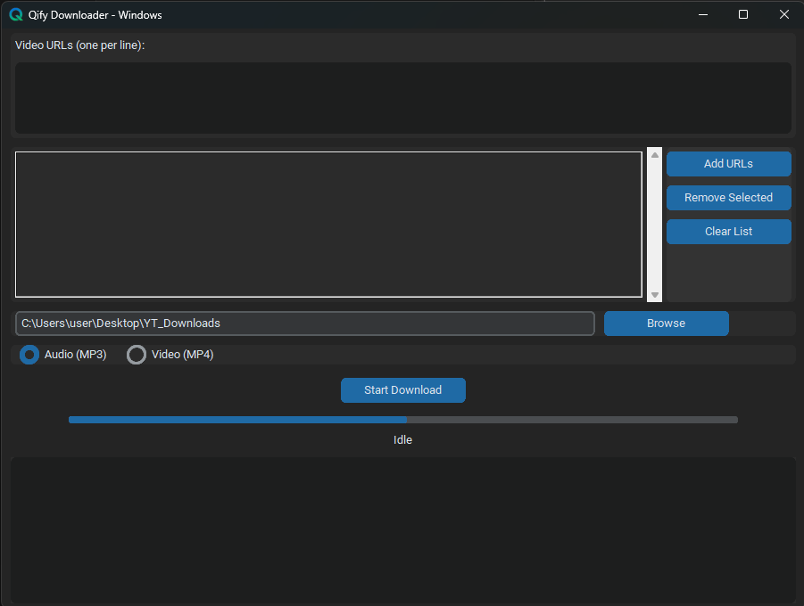

# QIFY Downloader

A modern Windows GUI media downloader built with **Python**, **CustomTkinter**, and **yt-dlp**.

> **Disclaimer:** This project is an independent open-source application and is **not affiliated with or endorsed by YouTube or Google**.

---

## Features

- Modern Windows GUI
- Download videos in MP4 format
- Download audio in MP3 format
- Multiple URL queue support
- Real-time download progress
- Download folder selection
- Automatic FFmpeg detection
- Built with CustomTkinter

---

## Requirements

### Run from Source

- Windows 10 or Windows 11
- Python 3.10 or later
- FFmpeg (installed or available in your system PATH)

Install the required Python packages:

```bash
pip install -r requirements.txt
```

Run the application:

```bash
python main.py
```

---

## Windows Executable

If you don't want to install Python, download the latest **QIFY Downloader.exe** from the **Releases** section.

---

## FFmpeg

QIFY Downloader automatically detects FFmpeg if it is installed and available in your system PATH.

If FFmpeg is not detected, install it and either:

- Add it to your Windows PATH, or
- Place it in:

```text
C:\ffmpeg\bin
```

---

## 📸 Screenshot



---

## License

This project is licensed under the **MIT License**.

---

## Credits

QIFY Downloader uses the excellent **yt-dlp** project for media extraction and downloading.

Thanks to the **yt-dlp** contributors for their work on this open-source project.

---

## Disclaimer

Users are responsible for ensuring that their use of this software complies with applicable copyright laws and the terms of service of the websites they access.

This project is intended for educational and personal use. The developers do not encourage or endorse copyright infringement.

---

## Support

If you find this project useful, consider giving it a ⭐ on GitHub.
